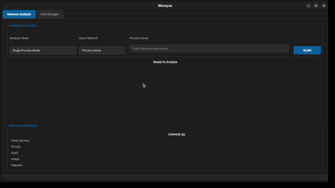

<p align="left">
  
</p>

# Memyze
**A praogram for developers to analyze memory consumption and network ports.**

Memyze helps developers understand how their applications consume memory and which ports they occupy, making debugging, optimization, and system monitoring easier.



---

## Features

### Memory Analysis
Analyze memory usage at different levels:

- **Single PID** – Inspect memory usage of a specific process (PID)
- **Entire Program** – Analyze all processes belonging to the same executable (related PIDs)
- **Complete System** – View all memory allocated by all processes

Memyze categorizes memory into four commonly used regions:

1. **Image**  
   Memory occupied by the main executable and loaded libraries.

2. **Private (Heap)**  
   Memory privately committed to the process, typically for dynamic allocation.

3. **Stack**  
   Stack memory used by threads (useful for identifying excessive stack usage).

4. **Mapped**  
   Memory mapped files and shared data.


---

### Port Management
Monitor and manage network ports directly from the application:

- View **which programs are listening on which ports**
- Identify **port conflicts**
- **Terminate a process occupying a port** to free it immediately


---

## Installation Guide

> ⚠️ Currently, **Memyze is only available on Linux** via AppImage.

### Run the AppImage

Download, make executable, and run:

```bash
wget https://github.com/justsomerandomdude264/memyze/raw/main/Memyze-x86_64.AppImage
chmod +x Memyze-x86_64.AppImage
./Memyze-x86_64.AppImage
```

### AppImageLauncher Integration (Optional)

Memyze can be integrated into your system menu using **AppImageLauncher**.

1. Install AppImageLauncher from:
   [https://github.com/TheAssassin/AppImageLauncher](https://github.com/TheAssassin/AppImageLauncher)
2. Run the AppImage
3. When prompted, select **“Integrate and run”**.

This will add Memyze to your application launcher for easy access.

---

## Contribution

Support needed to make windows and macOS compatible version, as they use different types of process management and have a different overall environment.

---

